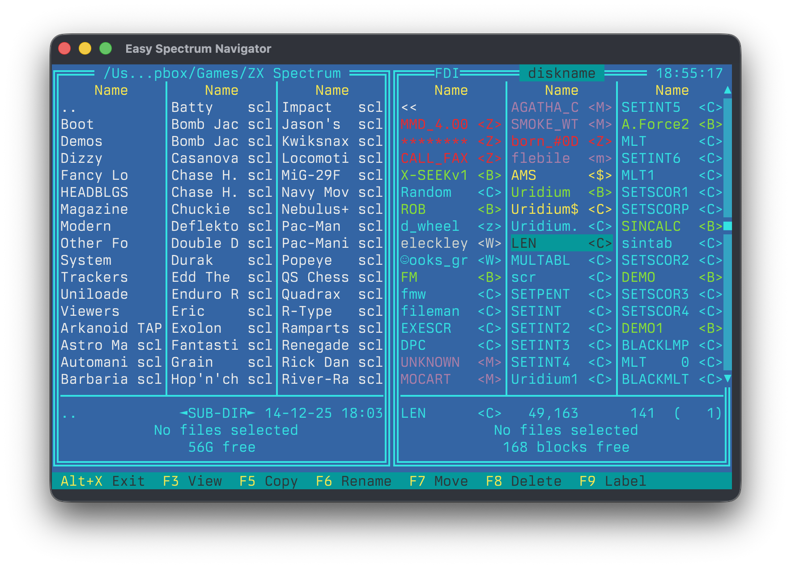

# Easy Spectrum Navigator

A dual-panel file manager for ZX Spectrum disk images, ported from the
original DOS program by [RomanRom2](https://zxsn.ru/) to Free Pascal
for macOS and Linux.

<p align="center">
  
</p>

ESN provides a Norton Commander-style interface for browsing, copying,
moving, and deleting files across ZX Spectrum disk and archive formats.

## Supported Formats

| Format | Description                          |
|--------|--------------------------------------|
| TRD    | TR-DOS virtual disk image            |
| SCL    | Multi-file container                 |
| FDI    | Full Disk Image with track metadata  |
| FDD    | Floppy disk image (Scorpion256)      |
| TAP    | Tape image                           |
| ZXZIP  | Compressed archive                   |
| Hobeta | Individual files with TR-DOS headers |

## Building

Requires [Free Pascal Compiler](https://www.freepascal.org/) (fpc).

```
make
```

The binary is produced at `bin/esn`.

## Usage

```
./bin/esn
```

## Testing

```
make test             # run all tests
make unit-test        # run unit tests only
make integration-test # run integration tests (requires tmux)
```

## License

See the [original program's website](https://zxsn.ru/) for license
information.
